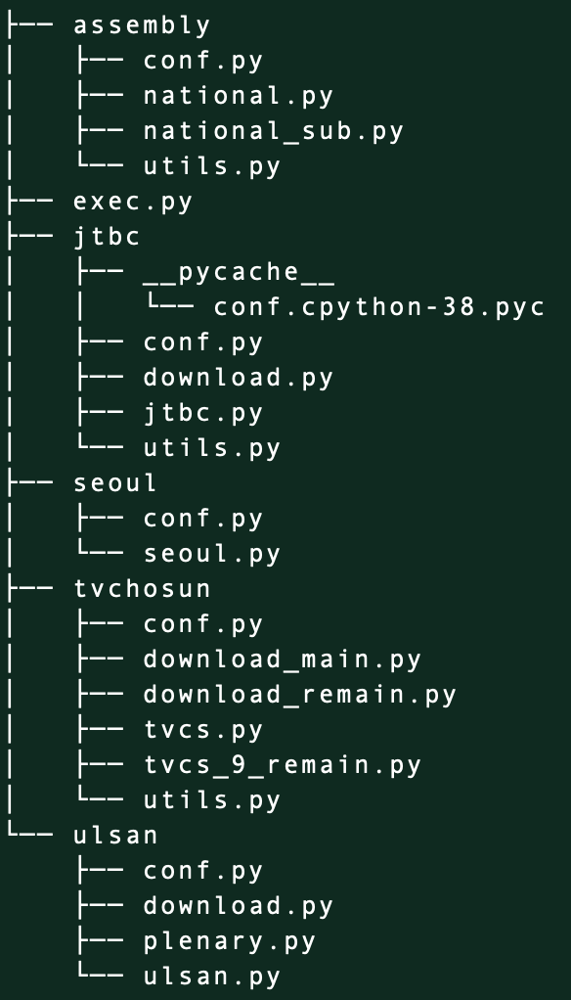
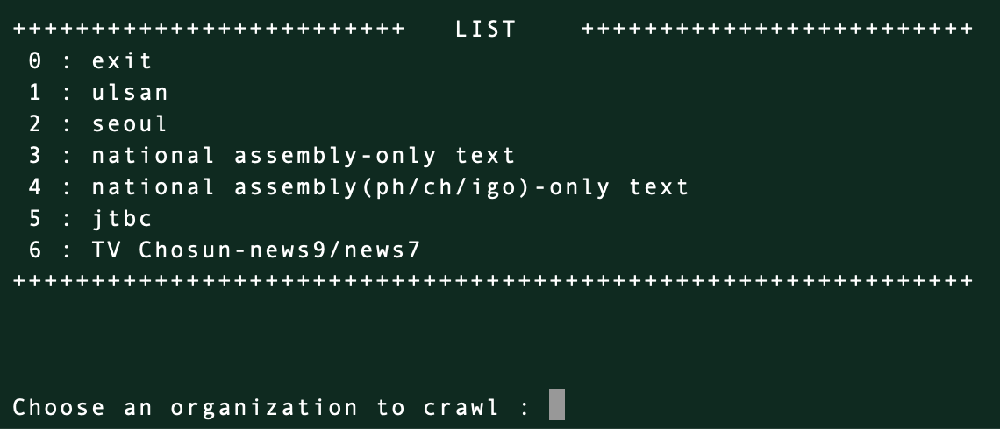
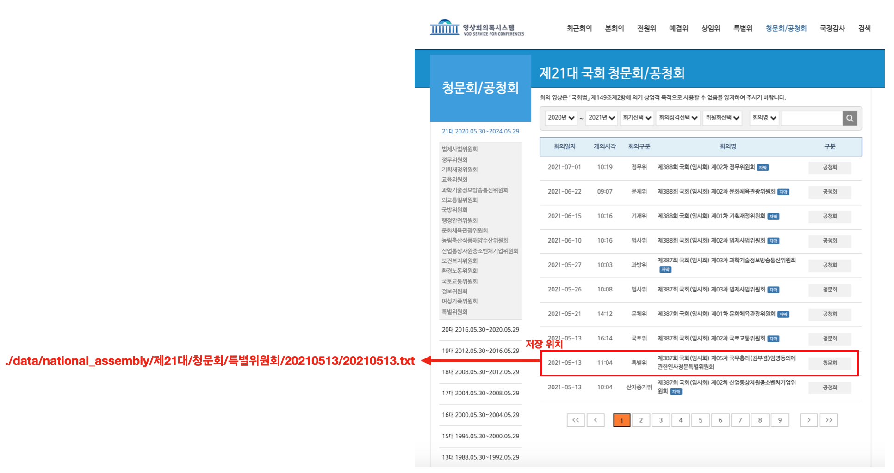
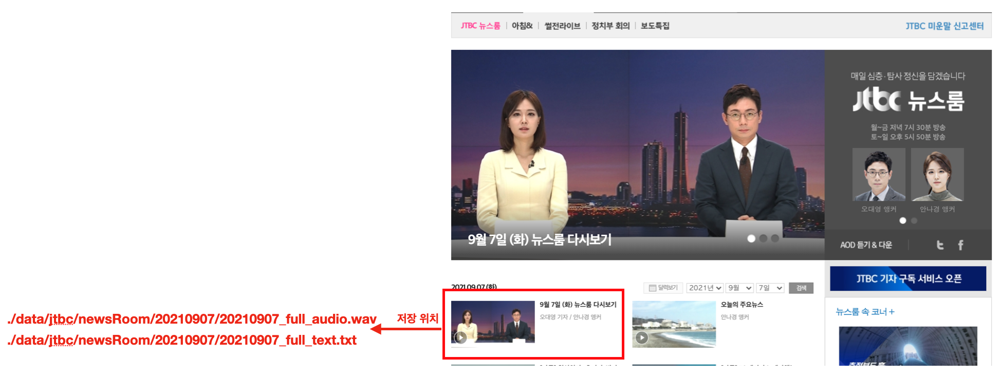
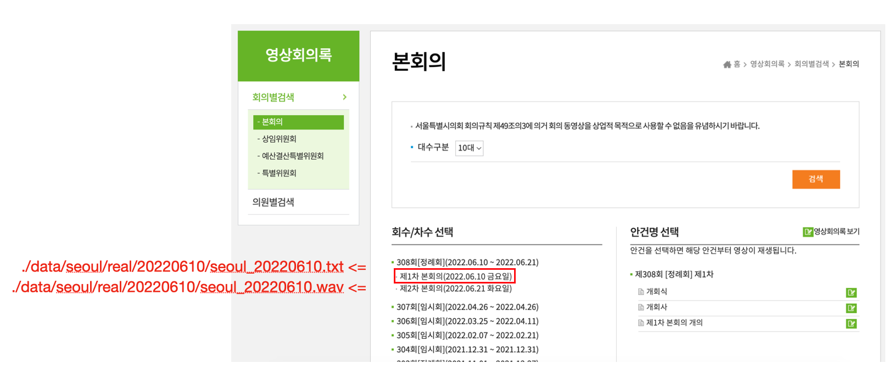
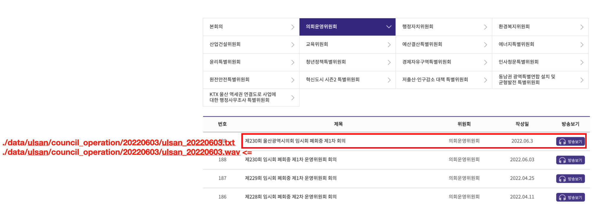

# Audio & Text Crawling    

  - [Structure](#structure)
  - [Manual](#manual)
  - [File System](#file-system)
  - [Performance](#performance)

## Structure

> __assembly__ => 국회 
> __jtbc__ => JTBC 뉴스룸 
> __seoul__ => 서울특별시의회 
> __tvchosun__ => TV조선 News7 & News9 
> __ulsan__ => 울산광역시의회

## Manual
- requirements.txt의 모듈 설치
- exec.py 실행

- 번호 혹은 글자 입력

## File System
### assembly

### jtbc

### seoul

### tvchosun

### ulsan

