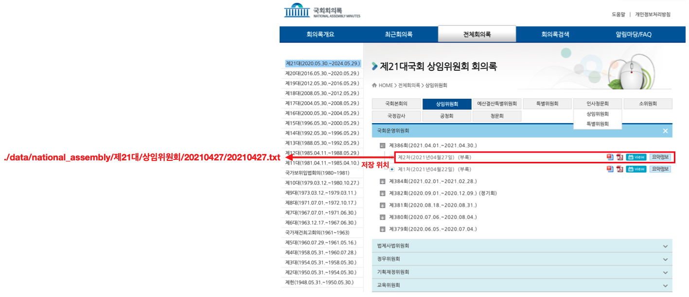
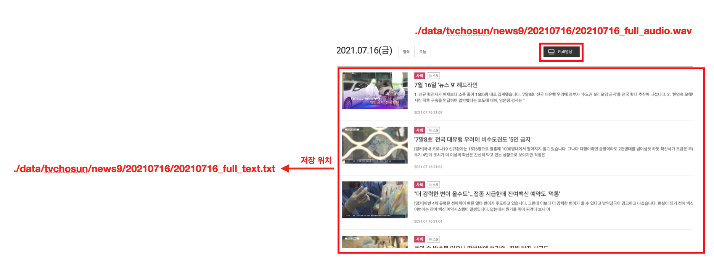
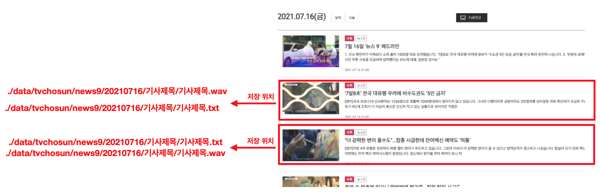

# Audio & Text Crawling    

>사전에 각 사이트의 robots.txt 참조

  - [시스템 구조](#시스템-구조)
  - [메뉴얼](#메뉴얼)
  - [국회](#국회)
  - [JTBC](#JTBC)
  - [서울특별시의회](#서울특별시의회)
  - [TV조선](#TV조선)
  - [울산광역시의회](#울산광역시의회)

## 시스템 구조

> __assembly__ => 국회 
> __jtbc__ => JTBC 뉴스룸 
> __seoul__ => 서울특별시의회 
> __tvchosun__ => TV조선 News7 & News9 
> __ulsan__ => 울산광역시의회

## 메뉴얼
- requirements.txt의 모듈 설치
- exec.py 실행

- 번호 혹은 글자 입력

## 국회
### national.py
- 국회회의록 데이터(소위원회, 국정감사, 국정조사, 공청회, 청문회 제외)
- national.py는 iframe으로 레이어가 구성되어 있어 오직 selenium 라이브러리를 사용하여 데이터에 접근
	- >총 9531개의 데이터를 접근해야하기 때문에 작업 속도를 향상시키기 위해 2개의 스레드를 생성하여 작업
- 총 데이터: 9531개

### national_sub.py
- 국회회의록 데이터(국회본회의, 예산결산특별위원회, 상임위원회, 특별위원회, 인사청문회, 공청회, 청문회, 국정감사)
- 사이트의 header 부분이 변경 + 회의록 텍스트 추출 및 저장 => selenium
- 이외의 다른 모든 작업 => beautifulsoup4
- 최종 회의록 텍스트 추출 및 저장은 메인 스레드의 작업과 별개의 작업으로 별도의 스레드를 생성하여 진행
- 총 데이터: 3062개

> 텍스트 전처리 
>  - 괄호 안 문자가 올 경우(임시회 제외) 괄호 안 문자 제거
>  - 영어, 숫자, 한글, 공백, %를 제외한 문자 제거
>  - . ? !로 문장이 끝났을 경우 개행 문자 추가

### 파일 저장 구조

  
  

## JTBC
### jtbc.py
- 2015년 1월 2일 ~ 최신 날짜까지의 ‘JTBC 뉴스룸’의 영상 음성 데이터, 텍스트 데이터 추출 및 저장
- 텍스트 전처리
	- 특수문자 제거
	- 문장 단위로 분리
	- 음성 파일에 없는 부분 제거
- 총 데이터: 3599개

### jtbc_9_remain.py
> TV조선 뉴스9 일부 풀영상과 텍스트가 맞지 않은 날짜 추출 및 저장 (웹페이지 구조의 차이)

- jtbc.py 실행 후 자동으로 tvcs_9_remain.py 실행
- 텍스트 파일의 크기가 0byte인 경우만 추가적으로 크롤링
- 풀영상에서 음성 데이터를 추출하지 않고 날짜 기준으로 모든 기사 영상과 텍스트를 추출 및 저장

### 파일 저장 구조

## 서울특별시의회
### seoul.py
- 회의별 분류 & 총 데이터
	- 본회의: real => 436개
	- 운영위원회: operation => 92개
	- 행정자치위원회: administration => 213개
	- 기획경제위원회: economy => 211개
	- 환경수자원위원회: environment => 194개
	- 문화체육관광위원회: physical => 201개
	- 보건복지위원회: sanitation => 195개
	- 도시안전건설위원회: safe => 178개
	- 도시계획관리위원회: plan => 223개
	- 교통위원회: traffic => 172개
	- 교육위원회: edu => 212개
	- 예산결산특별위원회: budget => 66개
	- 특별위원회: special => 74개

### 파일 저장 구조

## TV조선
### tvcs.py
- JTBC 뉴스9 / JTBC 뉴스7 최신 날짜부터 풀영상 음성 데이터와 텍스트 데이터 추출 및 저장
	- 뉴스9 => 2013년 3월 4일 시작
	- 뉴스7 => 2017년 7월 8일 시작
- 텍스트 전처리
	- 텍스트 문장 단위로 분리
	- 특정 조건에 해당할 경우 해당 문장 제거
		> 텍스트에 ‘[‘, ‘]’, ‘/‘가 포함될 경우 
		> 텍스트의 길이가 1 미만 
		> 텍스트의 시작 문자가 ‘.’, ‘?’, ‘!’일 경우
		
	- 음성 데이터에 없는 특수 문자(‘%’, ‘.’ 제외) 제거
- 총 데이터
	- 뉴스9: 2381개
	- 뉴스7: 423개

### 파일 저장 구조

  
  

## 울산광역시의회
### ulsan.py
- 회의별 분류 & 총 데이터
	- 본회의: plenary_meeting => 191개
	- 의회운영위원회: council_operation => 130개
	- 행정자치위원회: administration => 401개
	- 환경복지위원회: environment => 321개
	- 산업건설위원회: industry => 377개
	- 교육위원회: education => 363개
	- 예산결산특별위원회: budget => 80개
	- 에너지특별위원회: energy => 4개
	- 청년정책특별위원회: young => 2개
	- 경제자유구역특별위원회: economy => 1개
	- 인사청문특별위원회: confirmation => 6개
	- 원전안전특별위원회: nuclear => 1개
- 텍스트 전처리
	- 회의록 html이 암호화 되어있어 페이지 전체를 content로 불러와 한글과 숫자만 추출
	- 숫자 사이 ‘.’이 있을 경우 소수로 판단

### 파일 저장 구조

